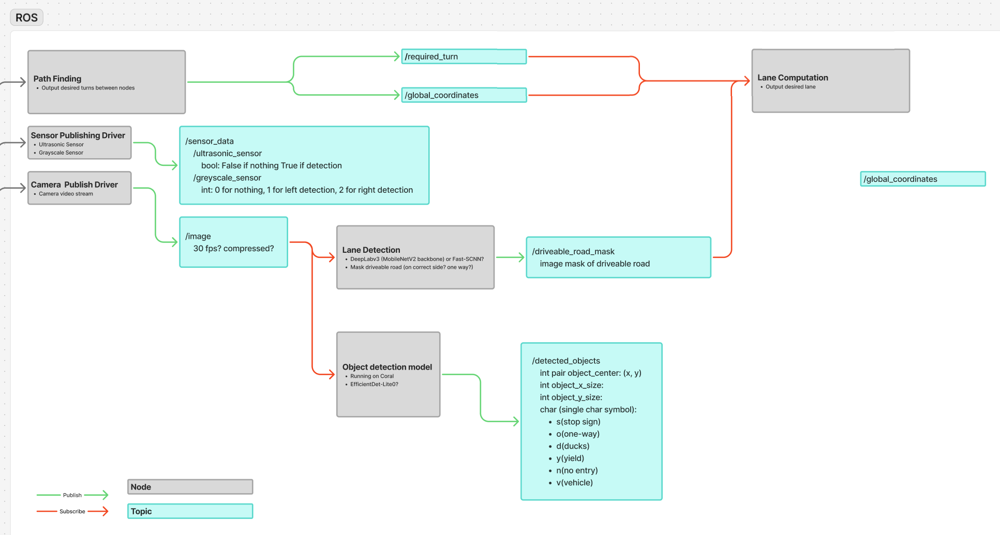
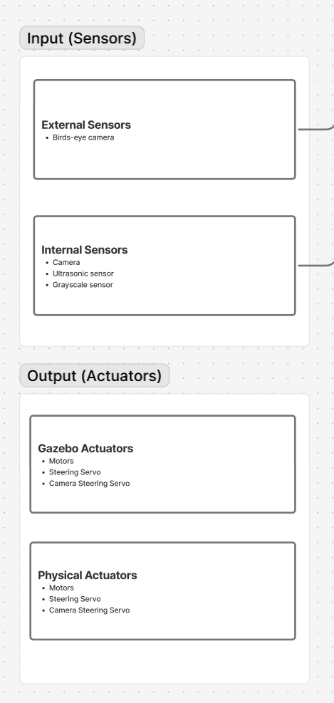

## 1. Objective

To finalize the system architecture for the PiCar-X autonomous navigation system, including OS selection, ROS2 framework setup, hardware configuration decisions, and initial conceptual design of the perception and planning modules.

## 2. Work Summary

### Session 1: 8:30 AM - 10:30 AM (2.0 hours)

**Operating System Selection:**
- Debated Ubuntu vs PiOS for the Raspberry Pi platform
- **Decision**: Ubuntu selected as primary OS requirement
  - **Rationale**: Gazebo simulation environment requires Ubuntu
  - PiHat drivers now confirmed working on Ubuntu (previously a blocking concern)

**Hardware Status Check:**
- Camera currently non-functional - troubleshooting required
- Explored option of using a dedicated Pi Camera module to offload AI model processing
  - Could reduce compute burden on main Pi

**Compute Power Discussion:**
- Considered upgrading to Raspberry Pi 5 for additional processing capability
  - **Risk identified**: PiHat compatibility uncertain with Pi5
  - **Blocking issue**: Power supply insufficient for Pi5 operation (brownout risk)
  - **Decision**: Defer Pi5 upgrade pending power solution

**ROS2 Framework Selection:**
- **Decision**: ROS2 Humble selected
  - **Rationale**: Compatible with both WSL (Windows Subsystem for Linux) and Ubuntu, allowing flexible development environments across team members

### Session 2: 2:30 PM - 5:30 PM (3.0 hours)

**Dual-Pi Architecture Exploration:**
- Proposed architecture: Two Raspberry Pis in parallel
  - Pi 1: Dedicated to compute-intensive tasks (perception models, planning)
  - Pi 2: Dedicated to sensor interfacing and actuation
- **Assessment**: Potentially over-engineered for current requirements
- **Decision**: Table this option; revisit only if single-Pi performance proves insufficient

**Software Development Strategy:**
- **Decision**: Implement ROS nodes in Python initially
  - If performance bottlenecks emerge, rewrite critical nodes in C++
  - Allows rapid prototyping while maintaining performance flexibility

**Camera Hardware Debugging:**
- **Symptom**: Camera indicator light not illuminating
- **Test 1**: Replaced ribbon cable → Issue persisted
- **Test 2**: Swapped in spare camera module → Testing in progress
- **Hypothesis**: Hardware failure in original camera module (see image: `../../images/week5/camera-ribbon-cable-replacement.jpg`)

**Development Environment Setup:**
- Successfully installed ROS2 Humble on WSL
- Installation process was straightforward with no major issues
- Team members can now develop ROS nodes locally before deploying to Pi

**ROS Architecture Design (In Progress):**
- Began detailed conceptual design of ROS node structure
- Defined pub/sub topic architecture (see detailed diagram below)
- Identified required data types for inter-node communication
- **Status**: Core architecture defined, implementation details ongoing

*Figure 1: ROS2 node and topic architecture showing data flow between perception, planning, and control modules*

### ROS Node Architecture

The preliminary architecture defines the following nodes and topics:

**Nodes (Processing Units):**
1. **Path Finding Node**
   - Publishes: `/required_turn`, `/global_coordinates`
   - Functionality: Dijkstra-based routing between graph nodes

2. **Sensor Publishing Driver**
   - Publishes: `/sensor_data` topic containing:
     - `/ultrasonic_sensor`: Boolean (False if clear, True if obstacle detected)
     - `/grayscale_sensor`: Integer (0 = nothing, 1 = left line, 2 = right line)
   - Interfaces with: Ultrasonic sensor, Grayscale sensor

3. **Camera Publish Driver**
   - Publishes: `/image` topic (30 fps? compressed?)
   - Provides: Camera video stream for perception pipeline

4. **Lane Detection Node**
   - Subscribes: `/image`
   - Publishes: `/driveable_road_mask` (image mask of driveable road)
   - Models under consideration: DeepLabv3 (MobileNetV2 backbone) or Fast-SCNN
   - Question: Mask driveable road (on correct side) or one-way indicator?

5. **Object Detection Model Node**
   - Subscribes: `/image`
   - Publishes: `/detected_objects` containing:
     - `object_center`: (x, y) pixel coordinates
     - `object_x_size`, `object_y_size`: Bounding box dimensions
     - `char` (single character symbol): Object type identifier
       - `s` = stop sign
       - `o` = one-way sign
       - `d` = ducks
       - `y` = yield sign
       - `n` = no entry sign
       - `v` = vehicle
   - Platform: Running on Google Coral TPU accelerator
   - Model: EfficientDet-Lite0 (tentative)

6. **Lane Computation Node**
   - Subscribes: `/required_turn`, `/global_coordinates`, `/driveable_road_mask`, `/detected_objects`
   - Publishes: `/global_coordinates` (feedback loop for localization updates)
   - Functionality: Integrates perception outputs with planning commands to compute desired lane position

**Data Flow Overview:**
- Green arrows: Publishing (node → topic)
- Red arrows: Subscribing (topic → node)
- Cyan boxes: ROS topics (message queues)
- Gray boxes: ROS nodes (processing units)

## 3. Design Decisions & Technical Analysis

### 3.1 Perception Strategy

**Road Sign Detection:**
- **Observation**: All road signs are uniform size in the Quackston environment
- **Decision**: Use bounding box detection with simple computer vision
- **Distance Estimation Method**: 
  - Calculate distance using bounding box dimension to camera resolution ratio
  - Formula: $d \propto \frac{f \cdot h_{real}}{h_{pixels}}$ where $f$ is focal length, $h_{real}$ is known sign height, and $h_{pixels}$ is detected bounding box height

**Duck Detection:**
- **Challenge**: Ducks vary in size (not uniform like signs)
- **Proposed Solution**: Implement depth estimation model
  - Allows accurate distance measurement regardless of duck size
  - Higher computational cost - requires performance testing

### 3.2 Graph Representation & Pathfinding

**Map Representation Options Discussed:**
1. **Pixel-based graph**: Represent navigable space at pixel resolution
   - **Pro**: High granularity
   - **Con**: Computationally expensive, likely unnecessary
2. **Node-based graph**: Discrete waypoints at intersections
   - **Pro**: Efficient computation, matches town structure
   - **Con**: Requires manual node placement and connection definition

**Dynamic Replanning Considerations:**
- Path optimization criteria: Maximize straight segments (reduce turning overhead)
- Adaptive replanning: Use bird's-eye camera view to update map state
  - Detect dynamic obstacles (other cars, ducks)
  - Trigger route recalculation when blockages detected
  - **Question**: What replanning frequency is optimal? Every 1s? 5s? Event-driven?

## 4. Action Items for Next Session

1. **Perception Model Scope Definition:**
   - Finalize detection priority order
   - Current candidate ordering: Collision → Ducks → Cars → Road Signs → Lane Detection
   - **Decision needed**: Single unified model vs. separate models for object detection and lane detection?

2. **ROS Architecture Completion:**
   - Finish detailed node and topic diagram
   - Define message types for each topic
   - Specify node responsibilities and interfaces

3. **Camera Resolution:**
   - Complete testing of replacement camera module
   - If hardware failure confirmed, order replacement part

4. **Development Workflow:**
   - Establish Git branching strategy for parallel ROS node development
   - Set up continuous integration testing in Gazebo simulation

## 5. Supporting Documentation

### System Architecture Diagrams

*Figure 2: Physical system architecture showing input sensors and output actuators*

**Input Sensors:**
- **External Sensors:**
  - Birds-eye camera (for global map state observation)
- **Internal Sensors:**
  - Camera (front-facing for perception)
  - Ultrasonic sensor (obstacle detection)
  - Grayscale sensor (line following)

**Output Actuators:**
- **Gazebo Actuators** (Simulation):
  - Motors
  - Steering Servo
  - Camera Steering Servo
- **Physical Actuators** (Hardware):
  - Motors
  - Steering Servo
  - Camera Steering Servo

### Images Referenced
- **ros-architecture-diagram.png**: Complete ROS2 node and topic architecture (Figure 1)
- **physical-system-overview.png**: Input/output system diagram (Figure 2)
- **raspberry-pi5-hardware.jpg**: Raspberry Pi 5 unit - higher processing power but requires upgraded power supply
- **camera-ribbon-cable-replacement.jpg**: Camera ribbon cable replacement during debugging process

### External References
- ROS2 Humble Documentation: https://docs.ros.org/en/humble/
- Gazebo Simulation: https://gazebosim.org/
- PiCar-X Documentation: [Add link if available]
- Google Coral TPU: https://coral.ai/products/accelerator

## 6. Notes & Reflections

**Team Collaboration:**
This session involved extensive collaborative brainstorming on system architecture. The dual-Pi concept was valuable to explore even though we decided against it - the discussion helped clarify our actual compute requirements.

**Risk Management:**
The camera hardware failure is a blocking issue for perception development. We have a backup camera ready, but should consider ordering an additional spare to prevent future delays.

**Next Steps Priority:**
The ROS architecture diagram is critical path work - without a clear node structure, parallel development becomes difficult. This should be completed before the next session so team members can begin implementing individual nodes independently.
