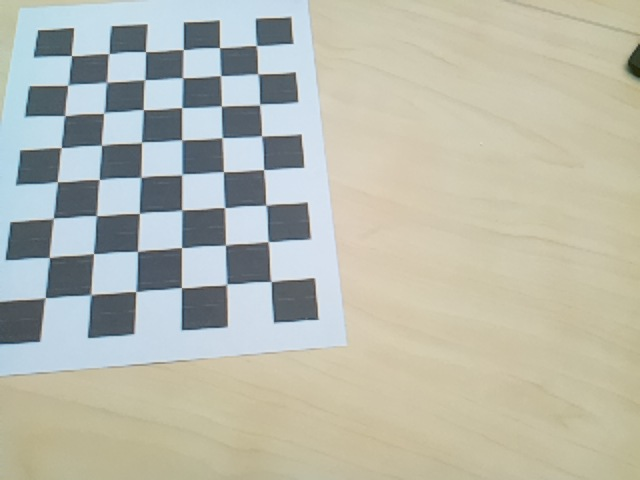
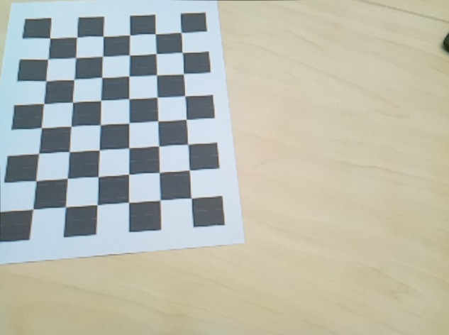

# Engineering Logbook Entry

## 1. Session Objective

- Evaluate connecting PiCar-X to QueensU-Secure WiFi
- Continue development of headless workflow
- Perform full camera calibration procedure
- Prepare calibration scripts for SSH-based execution

## 2. System State Before Session

- PiCar connects reliably to mobile hotspot
- SSH workflow functional
- Camera uncalibrated
- Calibration scripts partially dependent on GUI (Qt)

## 3. Work Completed

### 3.1 Network Evaluation (QueensU-Secure)

Attempted to connect PiCar-X to QueensU-Secure WiFi.

**Observation:**

- Connecting to QueensU-Secure requires a monitor to retrieve the assigned IP address.
- This complicates headless operation.
- Workflow becomes less efficient compared to hotspot configuration.

**Decision:**

For rapid development and testing, hotspot connection remains simpler and more practical.

QueensU-Secure may still be reconsidered for improved bandwidth and reduced latency in later stages.

---

### 3.2 Camera Calibration Pipeline

Performed full intrinsic calibration workflow.

#### Step 1 — Checkerboard Generation

- Generated calibration checkerboard pattern for intrinsic calibration.
- Printed and prepared for image capture.

#### Step 2 — Image Acquisition

- Captured multiple images of checkerboard from different angles and distances.
- Implemented script to capture images automatically at ~5 second intervals.
- This improved dataset consistency and reduced manual timing error.

#### Step 3 — Headless Script Modification

Original calibration script included Qt GUI components.

Since system operates primarily over SSH:

- Removed Qt GUI dependencies.
- Refactored script to run entirely from command line.
- Ensured output is saved directly to file.

Result:

Calibration can now be executed fully headless.

#### Step 4 — Data Processing

- Processed captured images.
- Removed unusable frames (poor corner detection).
- Generated calibration parameters.
- Exported results to JSON format.

JSON includes:

- Camera matrix
- Distortion coefficients
- Reprojection error

#### Step 5 — Validation

- Applied calibration to previously uncalibrated test image.
- Verified visible distortion correction.
- Straight lines appear more linear after correction.

Calibration pipeline confirmed operational.

### Calibration Results

#### Uncalibrated Image

*Figure 1: Raw image captured from PiCar-X camera before applying intrinsic calibration. Visible lens distortion is present near image edges.*

#### Calibrated Image

*Figure 2: Image after applying camera matrix and distortion coefficients. Edge distortion reduced and straight lines appear corrected.*

---

## 4. Performance Observations

| Component                  | Status                         | Notes                              |
|---------------------------|--------------------------------|------------------------------------|
| Hotspot connection        | Stable                         | Preferred for headless workflow    |
| QueensU-Secure connection | Functional but inconvenient    | Requires monitor                   |
| Image capture automation  | Working                        | ~5s interval capture               |
| Calibration computation   | Successful                     | JSON generated                     |
| Undistortion test         | Successful                     | Visual improvement confirmed       |

---

## 5. Technical Insights

- Headless compatibility is critical for robotics development.
- Removing GUI dependencies significantly improves deployability.
- Automated image capture reduces human-induced bias in calibration datasets.
- Dataset quality directly impacts calibration stability.

---

## 6. Open Issues

- No quantitative reprojection error benchmarking yet.
- Need to version-control calibration parameters.
- Should test calibration impact on lane detection performance.

---

## 7. Next Actions

- [ ] Measure reprojection error numerically
- [ ] Integrate calibrated camera into lane detection node
- [ ] Compare detection accuracy before vs after calibration
- [ ] Re-evaluate QueensU-Secure once system fully stable

---

## 8. System Status at End of Session

PiCar-X now has:

- Fully automated, headless camera calibration workflow
- JSON-based intrinsic parameter export
- Validated distortion correction pipeline
- Stable hotspot-based development network

Vision subsystem infrastructure is now significantly more robust.

---

**Entry finalized:** 2026-02-10