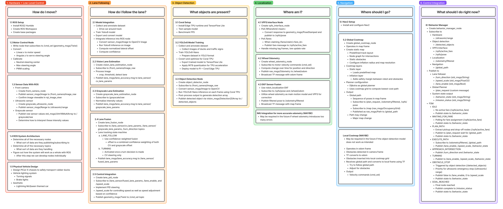
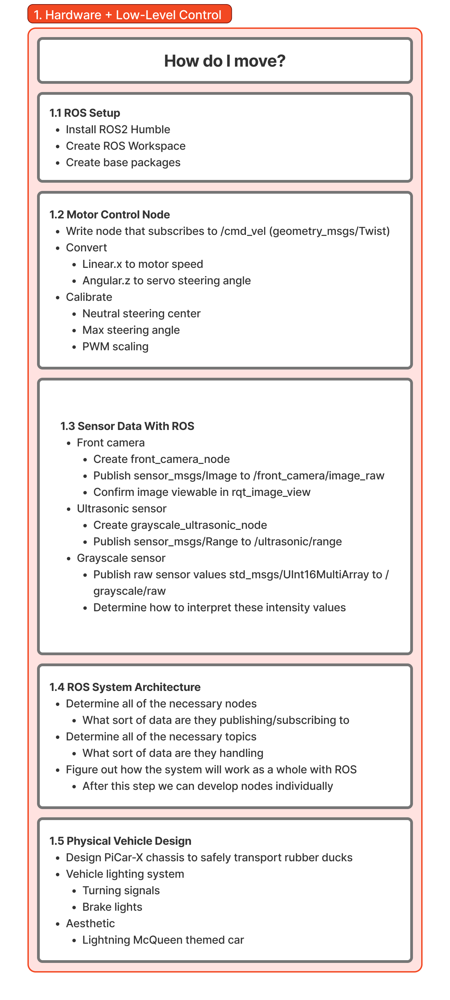
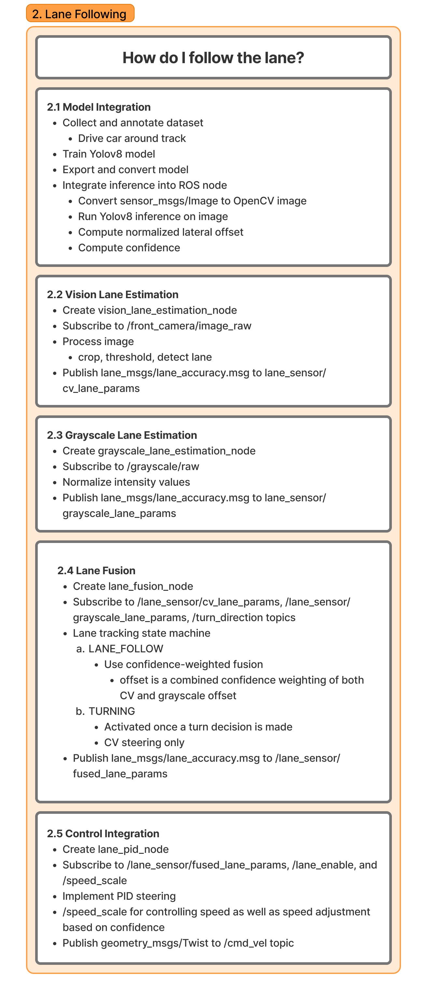
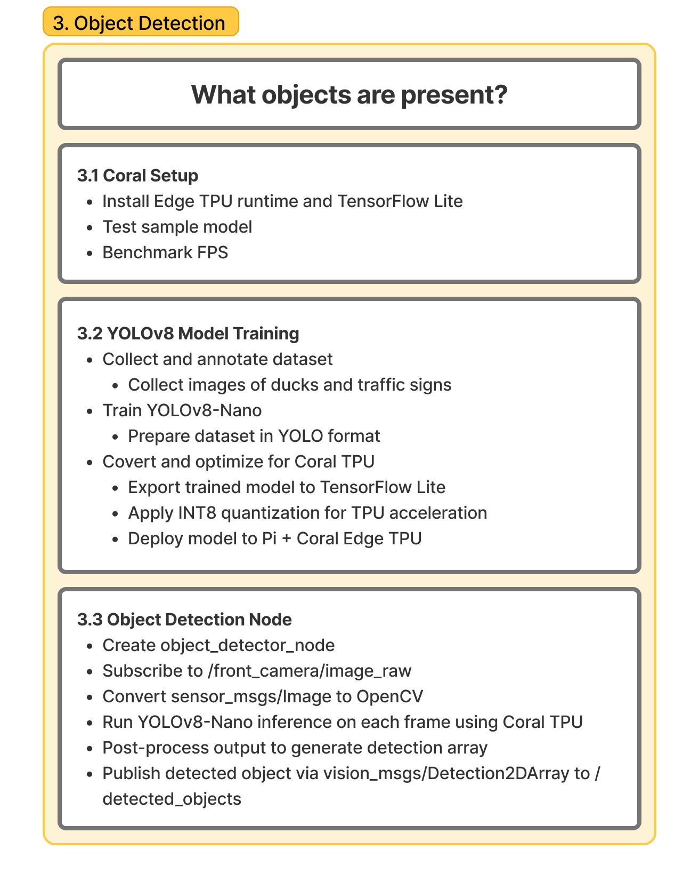
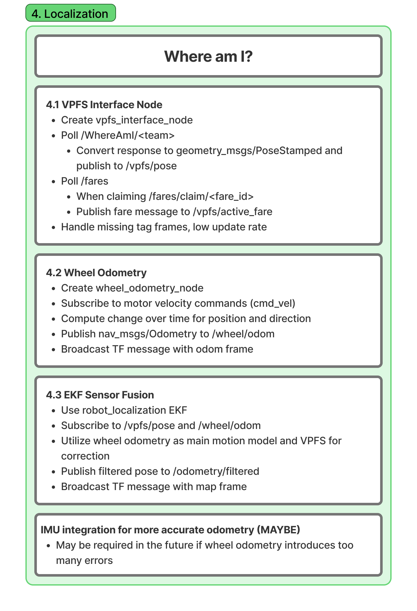
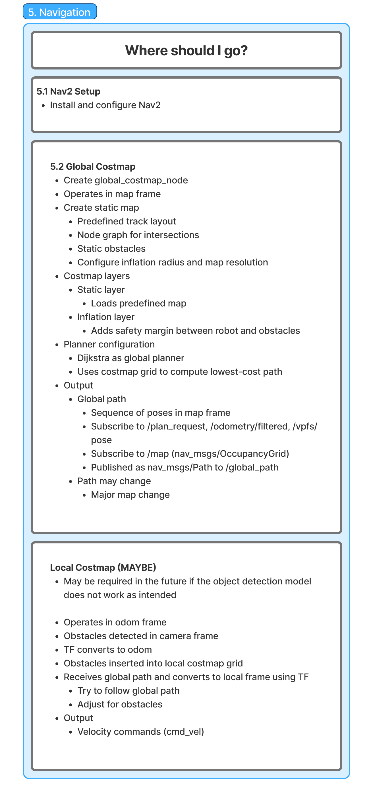
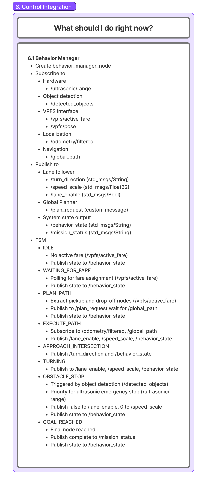

# System Architecture Draft

## Meeting Information

**Date:** 2026-02-26  
**Time:** 16:00 – 18:00  
**Duration:** 2.0 hours  
**Location:** WLH  
**Meeting Type:** Progress Update / Documentation Review  

### Attendees

- ✅ Ben – Integration  
- ✅ Jimmy – Computer Vision  
- ✅ Filip – Hardware  
- ✅ Clarke – Autonomy  

---

## 📋 Agenda

1. Record stabilized training footage  
2. Review first draft of system structure diagram  
3. Discuss documentation accessibility (Figma sharing)  

---

## 📝 Discussion Summary

### 1. Stabilized Video Data Collection

**Context:**  
After resolving camera mounting instability and vibration issues, we conducted another round of video recording.

**Key Points Discussed:**

- Camera is now securely mounted  
- Video quality significantly improved  
- Reduced shake improves labeling accuracy and model training quality  
- Footage suitable for lane detection and object detection dataset generation  

**Decisions Made:**

- Proceed with labeling this new dataset  
- Use stabilized footage for initial unified model training  

**Action Items:**

- [ ] Jimmy – Begin labeling stabilized dataset – **Due:** 2026-02-28  
- [ ] Team – Validate dataset coverage (intersections, straightaways, turns) – **Due:** 2026-02-28  

---

### 2. System Structure Diagram – First Draft Completed

**Context:**  
The first full draft of the system architecture diagram has been completed.

**Tool Used:** Figma  

**View Link:**  
https://www.figma.com/board/kRxPZMRwYfKROtuz0q13gg/ROS-Structure?node-id=0-1&t=CQMRACLmVULzZBhF-1  

**Key Points Discussed:**

- Diagram reflects ROS node and topic structure  
- Subsystems clearly separated (Perception, Autonomy, Control, Integration)  
- Physical subsystem included  
- Awaiting team feedback before locking structure  

**Decisions Made:**

- Share diagram with full team for review  
- Treat this as version 1 (v1) of architecture  
- Collect structured feedback before making revisions  

**Action Items:**

- [ ] Team – Review Figma diagram and provide comments – **Due:** 2026-02-28  
- [ ] Clarke – Revise diagram based on feedback – **Due:** 2026-03-01  

---

### 3. System Architecture / Project Timeline

Below are the system architecture and milestone timeline diagrams.

#### 📌 Overall System Timeline

#### 🔧 Hardware

#### 🛣️ Lane Following

#### 🎯 Object Detection

#### 📍 Localization

#### 🧭 Navigation

#### 🔄 Control & Integration

---

## ✅ Decisions & Outcomes

### Technical Decisions

| Decision | Rationale | Impact | Alternatives Considered |
|----------|-----------|--------|------------------------|
| Use stabilized footage for training | Higher quality dataset | Better CV performance | Continue using shaky data |
| Treat diagram as v1 architecture | Encourage iteration | Structured refinement process | Informal evolving diagram |
| Export architecture as PDF + screenshots | Universal accessibility | Easier grading & review | Figma link only |

### Project Decisions

| Decision | Rationale | Impact |
|----------|-----------|--------|
| Collect structured diagram feedback | Avoid architectural drift | Stronger integration |
| Improve documentation accessibility | Prevent reviewer friction | More professional submission |

---

## 📦 Action Items & Next Steps

### Immediate Actions (This Week)

- [ ] **Jimmy** – Label stabilized footage – **Due:** 2026-02-28  
- [ ] **Clarke** – Add screenshots to repo – **Due:** 2026-02-27  
- [ ] **Team** – Provide diagram feedback – **Due:** 2026-02-28  

### Upcoming Actions (Next Week+)

- [ ] **Clarke** – Revise architecture to v2 – **Due:** 2026-03-01  
- [ ] **Team** – Validate architecture against Nav2 integration – **Due:** 2026-03-02  

---

## 📊 Project Status

### Overall Progress

**On Track**

- Stable dataset acquisition achieved  
- Architecture formally documented  
- Entering refinement and validation phase  

### Milestones

| Milestone | Target Date | Status | Notes |
|-----------|-------------|--------|-------|
| Stabilized Data Collection | 2026-02-26 | ✅ Complete | Dataset ready for labeling |
| System Architecture v1 | 2026-02-26 | ✅ Complete | Awaiting feedback |
| Architecture v2 | 2026-03-01 | ⏳ Upcoming | Based on review |

---

## 🎯 Next Meeting

**Date:** TBD  
**Time:** TBD  
**Location:** WLH  

**Proposed Agenda:**

1. Review architecture feedback  
2. Discuss model training progress  
3. Plan Nav2 integration testing  

---

## 💬 Additional Notes

Exporting the architecture diagram ensures accessibility for reviewers and graders who may not have Figma accounts. Maintaining both an editable source (Figma) and static documentation (PDF/screenshots) improves professionalism and long-term maintainability of project documentation.

---

**Minutes prepared by:** Clarke  
**Date submitted:** 2026-02-26  
**Reviewed by:** Team