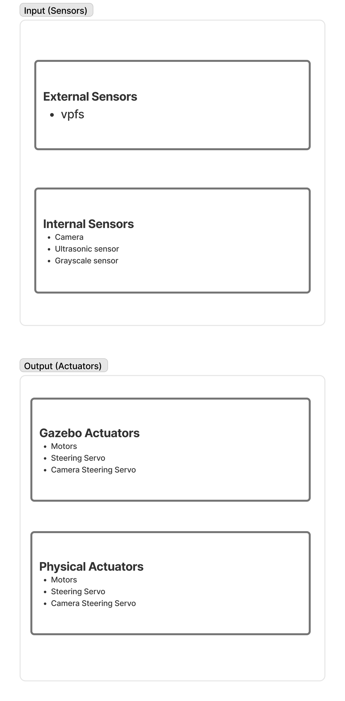
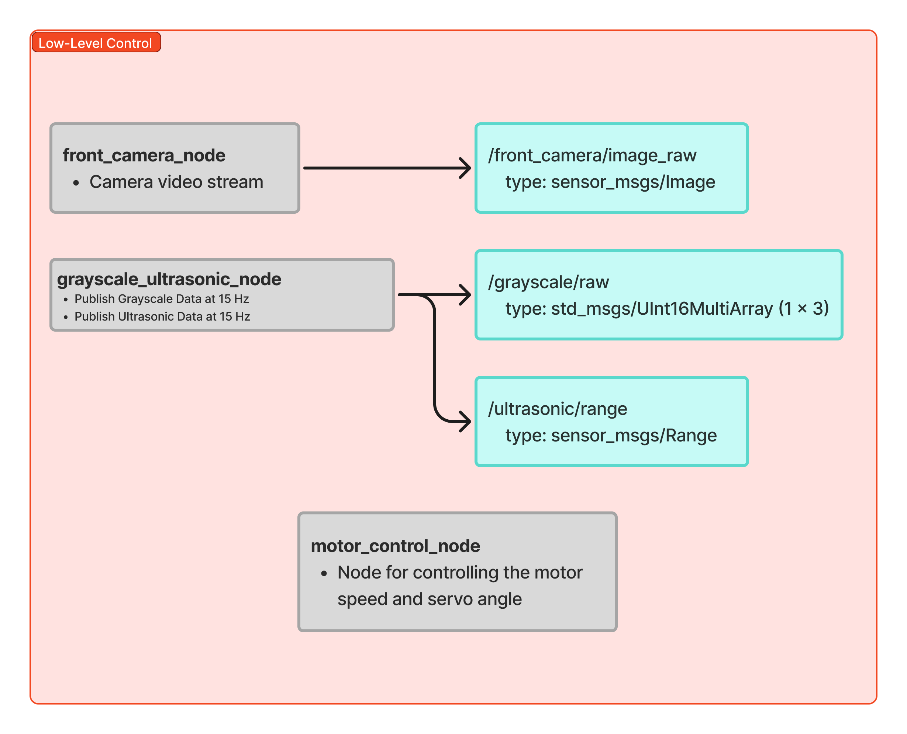
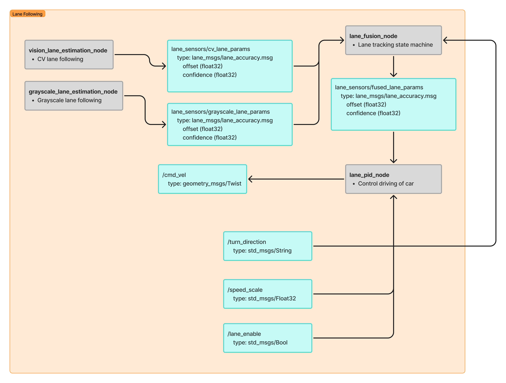
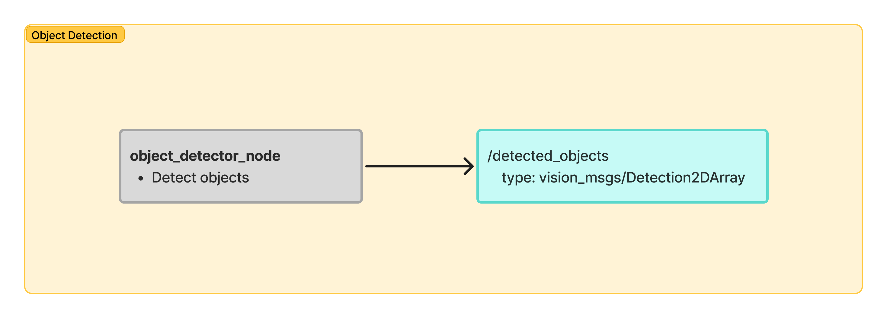
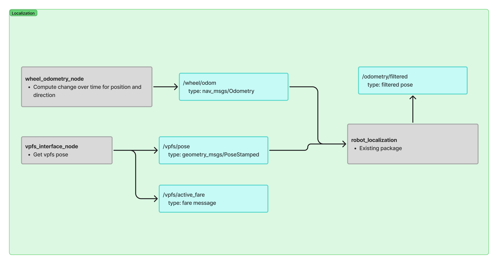
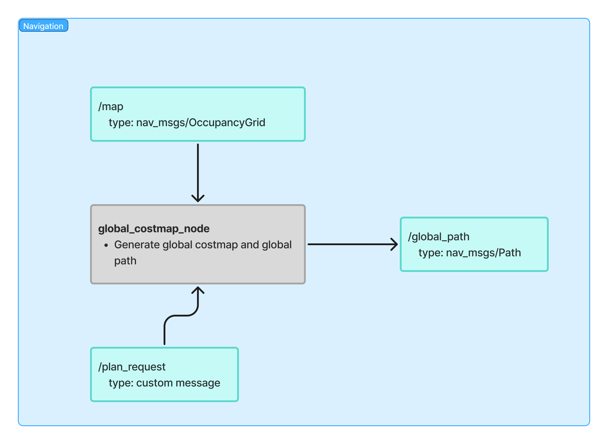
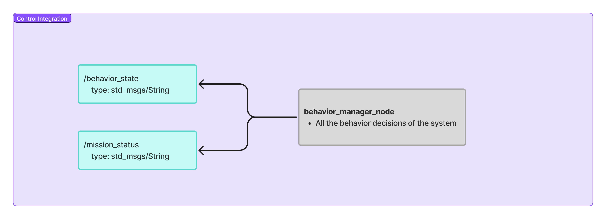

# ROS Node Diagram

## Meeting Information

**Date:** 2026-02-27  
**Time:** 10:00 – 13:00  
**Duration:** 3.0 hours  
**Location:** WLH  
**Meeting Type:** Design Review / Architecture Planning

### Attendees

- ✅ Ben – Integration  
- ✅ Clarke – Autonomy  
- ✅ Filip – Hardware  
- ✅ Jimmy – CV  

---

## 📋 Agenda

1. Refine system structure for intersection handling  
2. Discuss CV-based vs global-path-based intersection detection  
3. Update lane-following state logic  
4. Finalize ROS node diagram  
5. Establish GitHub development workflow  

---

## 📝 Discussion Summary

### 1. Review of Previous Action Items

| Action Item                    | Owner  | Status         | Notes                            |
| ------------------------------ | ------ | -------------- | -------------------------------- |
| Draft initial system structure | Clarke | ✅ Complete     | Used as baseline for refinements |
| Begin ROS node diagram         | Clarke | ⚠️ In Progress | Finalized during this meeting    |

---

### 2. Intersection Detection Strategy

**Context:**  
The previous architecture relied on a dedicated `INTERSECTION_DETECTION` state in the lane-following FSM. This approach was becoming redundant as global navigation improved.

**Key Points Discussed:**

- Behavior Manager will now:  
  - Poll localization TF values (pixel/world coordinates)  
  - Compare these values to the global path coordinates  
  - Detect when the robot is within a predefined threshold of a global path node (intersection)  
  - Trigger a turning decision at that point  

- Two approaches discussed:  
  - **Computer Vision (CV)-based intersection detection**  
  - **Global path + localization-based intersection detection**  

**Decisions Made:**

- ✅ Use **global path + localization comparison** as primary method  
  - Rationale: deterministic, aligned with navigation goals, avoids noisy CV classification  
- ✅ Remove `INTERSECTION_DETECTION` state from lane-following FSM  
  - New structure:  
    - `LANE_FOLLOW`  
    - `TURNING`  
  - Simplifies logic and reflects actual system behavior  

---

### 3. ROS Node Diagram Finalization

**Context:**  
ROS node diagram updated to reflect modular architecture.

**ROS Diagram:**  
https://www.figma.com/board/kRxPZMRwYfKROtuz0q13gg/ROS-Structure?node-id=5-28&t=CQMRACLmVULzZBhF-1

**Key Points Discussed:**

- Diagram updated to reflect:  
  - Behavior Manager polling localization TF  
  - Clear separation between: Lane Following, Turning, Localization, CV pipeline, Hardware interface nodes  
- Topics and node boundaries clearly defined  
- Architecture emphasizes modularity  

**Decisions Made:**

- ✅ Finalized ROS node diagram based on updated system structure  
- ✅ Diagram serves as authoritative reference for development  
- ✅ Use diagram to assign tasks per node  

**Impact:**

- Task assignment now straightforward  
- Each node can be developed/debugged independently  
- Clear topic interfaces reduce integration ambiguity  

**Action Items:**

- [ ] Add finalized ROS node diagram images to logbook – **Owner:** Ben – **Due:** 2026-02-28  
- [ ] Create GitHub issues per node – **Owner:** Clarke – **Due:** 2026-03-01  

**ROS Structure Images:**

- ROS Node Diagram:  
    
- ROS Hardware:  
    
- ROS Low-Level Control:  
    
- ROS Lane Following:  
    
- ROS Object Detection:  
    
- ROS Localization:  
    
- ROS Navigation:  
    
- ROS Control Integration:  
    

---

### 4. GitHub Development Workflow

**Context:**  
Modular architecture requires disciplined Git workflow.

**Proposed Workflow:**

1. Take task from GitHub project board  
2. Move issue to **In Progress**  
3. Create branch tied to that issue  
4. Develop exclusively on branch  
5. Submit Pull Request (PR) once complete  
6. Review before merging into main  

**Decisions Made:**

- ✅ Adopt issue-based branching strategy  
- ✅ No direct commits to `main`  
- ✅ Each PR must correspond to a single GitHub issue  

---

## ✅ Decisions & Outcomes

### Technical Decisions

| Decision                                     | Rationale                                          | Impact                                                 | Alternatives Considered              |
| -------------------------------------------- | -------------------------------------------------- | ------------------------------------------------------ | ------------------------------------ |
| Use global-path-based intersection detection | Deterministic and consistent with navigation goals | Simplifies FSM, improves reliability                  | CV-based intersection classification |
| Remove `INTERSECTION_DETECTION` state        | Reduces redundancy                                 | Cleaner FSM with clearer transitions                  | Keeping separate detection state     |
| Behavior Manager polls localization TF       | Centralizes decision-making                        | Clear separation between perception and decision logic | Distributed detection in CV node     |

### Project Decisions

| Decision                               | Rationale                              | Impact                                 |
| -------------------------------------- | -------------------------------------- | -------------------------------------- |
| Use modular node-based task assignment | Nodes clearly separated in diagram     | Enables parallel development           |
| Enforce PR-based workflow              | Prevent integration conflicts          | Improves code quality and traceability |

---

## 📦 Action Items & Next Steps

### Immediate Actions (This Week)

- [ ] **Clarke** – Implement node proximity check logic in Behavior Manager – **Due:** 2026-03-05  
- [ ] **Ben** – Validate integration of updated state transitions – **Due:** 2026-03-05  
- [ ] **Jimmy** – Ensure CV pipeline outputs lane state only – **Due:** 2026-03-05  
- [ ] **Filip** – Confirm no hardware constraints affect turning timing – **Due:** 2026-03-05  

### Upcoming Actions (Next Week+)

- [ ] **Team** – Full system integration test with updated FSM – **Due:** 2026-03-08  
- [ ] **Team** – Stress test localization drift at intersections – **Due:** 2026-03-10  

### Blocked Items

- ⛔ None currently identified  

---

## 🅿️ Parking Lot

- Evaluate CV-based intersection detection as redundancy in future milestone  
- Define numeric threshold distance for “intersection proximity”  
- Consider logging intersection entry/exit events for debugging  

---

## 📊 Project Status

### Overall Progress

**On Track**  
System architecture now significantly clearer and modular. Major structural ambiguities resolved.  

### Milestones

| Milestone                        | Target Date | Status         | Notes                             |
| -------------------------------- | ----------- | -------------- | --------------------------------- |
| System Architecture Finalization | 2026-02-27  | ✅ Complete     | Diagram finalized                 |
| Behavior Manager Refactor        | 2026-03-04  | ⚠️ In Progress | Intersection logic update pending |
| Full Integration Test            | 2026-03-10  | ⏳ Upcoming     | Depends on node completion        |

---

## 🎯 Next Meeting

**Date:** 2026-03-03  
**Time:** 4:30  
**Location:** WLH  

**Proposed Agenda:**

1. Review Behavior Manager implementation  
2. Integration testing updates  
3. Localization accuracy at intersections  

---

## 📎 Attachments & References

- ROS Node Diagram:  
    

- Updated System Structure Diagram:  
    

---

## 💬 Additional Notes

Updated architecture improves clarity and modularity. ROS node diagram directly maps to assignable development tasks, reducing integration risk. Removing the `INTERSECTION_DETECTION` state simplifies reasoning and debugging of the autonomy stack.  

---

**Minutes prepared by:** Clarke  
**Date submitted:** 2026-02-27  
**Reviewed by:** Team
