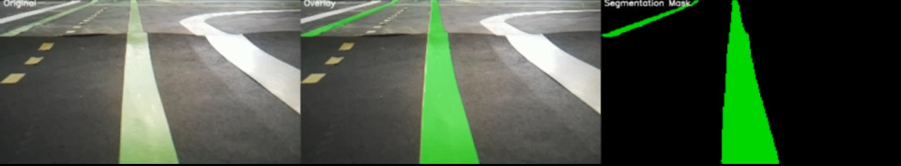

## 1. Objective

To train and deploy a TensorFlow Lite computer vision model for road mask detection on the PiCar-X using Google Coral TPU acceleration.

## 2. Work Summary

### Model Development

**Labeling:**
- Dataset labeled using Roboflow platform

**Training:**
- Model trained on Google Colab
- Output format: TensorFlow Lite (.tflite)

**Performance:**
- Achieved mask accuracy of 97%+

### Deployment

**Coral TPU Setup:**
- Configured Coral environment on the Raspberry Pi
- Prepared for real-time inference with hardware acceleration

## 3. Results

*Example output showing detected driveable road mask*

The trained model successfully identifies driveable road areas with high accuracy, enabling the vehicle to distinguish safe navigation zones from obstacles and boundaries.

## 4. Next Steps

- [ ] Integrate model into ROS2 perception pipeline
- [ ] Test inference speed on Coral TPU
- [ ] Validate performance on live camera feed

## 5. Supporting Documentation

### Images Referenced
- **road-mask-example.jpg**: Example of mask detection output

## 6. Notes & Reflections

**Model Performance:**
The 97%+ accuracy demonstrates that the labeled dataset was comprehensive and the training process was effective. This high accuracy is critical for safe autonomous navigation.

**Deployment Ready:**
With the Coral environment configured on the Pi, the model is ready for integration into the perception stack for real-time road detection.
