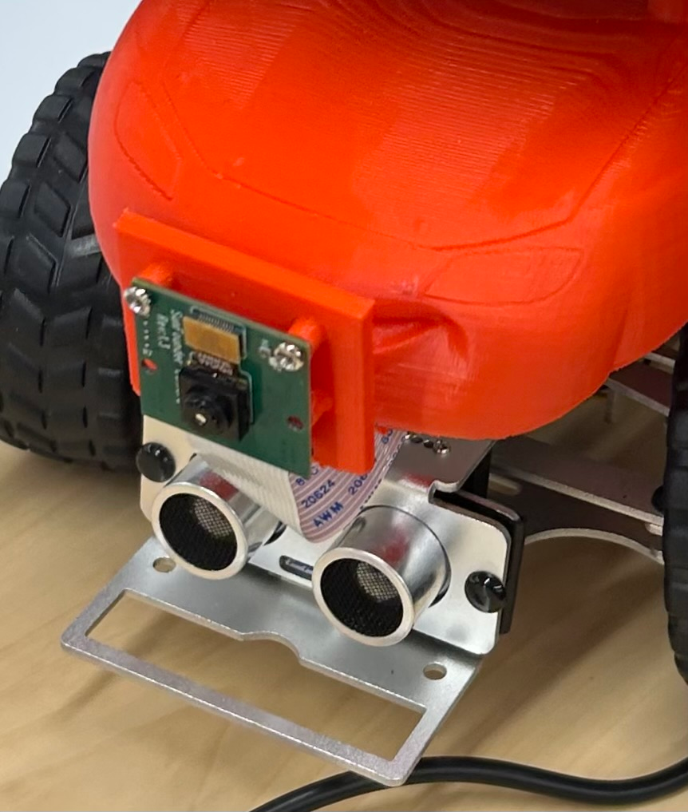

# 3D Printing — Two-Part Chassis, CARE & Camera Mount

## Objectives

- Print new two-part chassis model and assemble the joined halves
- Fabricate the CARE (cardboard duck holder) to better secure the duck
- Attach the new 3D-printed camera mount to the chassis
- Document all components with photos for the logbook

---

## Detailed Work Log

### Session 1: Hardware Assembly 

**Members Present**: All

**Process/Steps**:

1. Pick up 3D print
2. Make CARE holder
3. Integrate CARE into print
4. Attach camera mount to chassis and conduct initial test

## Challenges & Solutions

### Ideation — Alternatives Considered

- **Rigid mount vs. adjustable mount:** Since our CV model was designed around a static camera, a rigid mount was chosen over an adjustable one. A rigid mount reduces sway and keeps the camera more stable during operation, which improves detection consistency.

## Documentation

*Figure 1: CARE cardboard duck holder integrated into the two-part chassis print.*

*Figure 2: 3D-printed camera mount attached to chassis.*

---
 
## Next Steps
 
- [ ] Test camera mount on track — **Owner:** All
 

## Personal Notes

---

