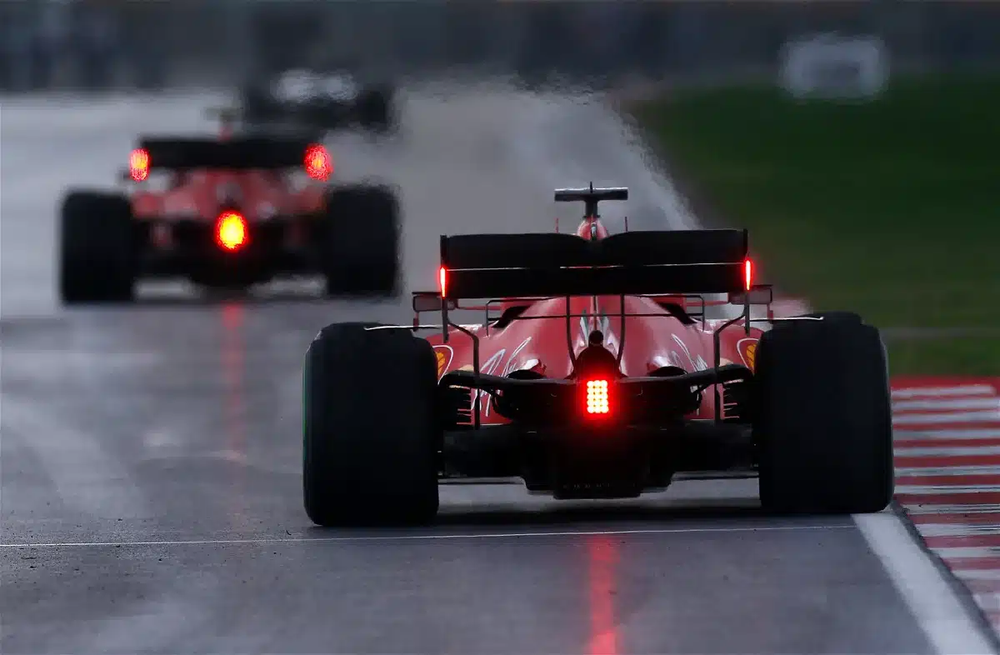

# Lighting System — Setup & Code Changes

## Objectives

- Set up and configure the lighting system for the robot
- Document the physical lighting setup with photos
- Implement and test code changes related to lighting control

---

## Detailed Work Log

### Session 1: Lighting Implementation

**Members Present**: All

**Process/Steps**:

1. Wrote initial lighting code — mapped turn signals and brake lights to PWM pins
2. Tested code without physical lights connected
3. Fixed code as it was causing the car to malfunction
4. Implemented physical wiring of lights

**Description**:

The lighting system is controlled inside `cmd_vel_to_robocar.py` as part of the main drive node. Four PWM channels are used:

| LED | Pin | Function |
|-----|-----|----------|
| Left turn signal | `P8` | Blinks when turning left or hazard active |
| Right turn signal | `P9` | Blinks when turning right or hazard active |
| Brake light 1 | `P10` | On when robot is stopped or timed out |
| Brake light 2 | `P11` | On when robot is stopped or timed out (paired with P10) |

The design uses a single-unit F1-style brake light at the rear (aesthetic chosen to match the Lightning McQueen 3D print), controlled via two PWM pins (P10 and P11) that are always toggled together.

**Turn signals** are driven by the `/turn_signal_cmd` topic (type `String`). The node subscribes to this topic and stores the state (`"LEFT"`, `"RIGHT"`, or `"NONE"`). A dedicated `blink_timer` fires every **0.25 seconds**, toggling a `blink_on` boolean and applying the current signal state:

- `"LEFT"` → P8 blinks, P9 stays off
- `"RIGHT"` → P9 blinks, P8 stays off
- `"NONE"` → both off

**Hazard mode** is triggered automatically by the `/ultrasonic/detected` topic (type `Bool`). When an obstacle is detected, `hazard_active` is set to `True` and the blink callback forces *both* turn signals to blink simultaneously, overriding any normal signal state.

**Brake lights** are activated whenever the robot is not receiving movement commands — specifically when both `linear.x` and `angular.z` are below `1e-3`, or when the `/cmd_vel` timeout of **0.5 seconds** is exceeded with no new message.

All LEDs are controlled via `pulse_width_percent(100)` for ON and `pulse_width_percent(0)` for OFF.

**Materials/Tools Used**:
- 4× PWM-controlled LEDs (left signal, right signal, 2× brake)
- robot_hat PWM library
- ROS 2 topics: `/turn_signal_cmd`, `/ultrasonic/detected`, `/cmd_vel`

---

## Results & Data

### Measurements/Observations

| Parameter | Expected | Measured | Pass/Fail | Notes |
|-----------|----------|----------|-----------|-------|
| Blink rate | 2 Hz | | | 0.25 s timer → toggles 4×/s → 1 full cycle = 0.5 s |
| Brake light trigger | Stop condition | | | Fires when \|v\| < 1e-3 and \|w\| < 1e-3 |
| Timeout before brake | 0.5 s | | | Defined by `timeout_s` parameter |

### Calculations

**Blink frequency from timer interval:**

$$
f_{\text{blink}} = \frac{1}{2 \times T_{\text{timer}}} = \frac{1}{2 \times 0.25\,\text{s}} = 2\,\text{Hz}
$$

Where:
- $T_{\text{timer}} = 0.25\,\text{s}$ — the `blink_timer` callback interval declared in `__init__`
- Factor of 2 because the boolean toggles on every callback — one full ON/OFF cycle = 2 callbacks = 0.5 s
- Result: LEDs blink at **2 Hz** (0.5 s per full cycle), which matches common automotive turn-signal standards (≈ 1.5–2 Hz)

**LED power control:**

$$
\text{Duty cycle} = \frac{\text{pulsewidthpercent}}{100} \times 100\% = \begin{cases} 100\% & \text{ON} \\ 0\% & \text{OFF} \end{cases}
$$

LEDs are driven at full duty cycle (full brightness) when on — no dimming is applied.

---

## Challenges & Solutions

### Ideation — Alternatives Considered

- **Two separate rear brake lights vs. single F1-style unit:** Initially considered a conventional two-light layout, but chose a single centrally-mounted brake light (two PWM channels driven together) to match the Lightning McQueen aesthetic of the 3D-printed chassis.
- Alternative considered:

### What Failed or Didn't Work

**Problem**: Initial code caused the car to malfunction when lighting logic was introduced.

**Debugging Steps**:
1. Tested lighting code without physical lights connected to isolate software issues
2. Identified conflicting logic between motor control and LED state updates
3. Fixed the issue and re-tested

**Solution**:

**Lessons Learned**:

### Why We Chose Our Final Solution

F1-style single rear brake light was chosen for aesthetic fit with our Lightning McQueen chassis. Functionally, two PWM pins (P10, P11) driving the same physical unit gives hardware redundancy at no extra code cost — they are always controlled together via `_set_brake_lights()`.

---

## Documentation

### Code Snippets

**Snippet 1 — LED initialisation and low-level PWM control**

The four LED PWM objects are initialised in `_init_hw_or_die()`, and all state changes go through helper methods that guard against redundant writes:

```python
# LED hardware init (inside _init_hw_or_die)
self.left_led   = PWM("P8")
self.right_led  = PWM("P9")
self.stop_led_1 = PWM("P10")
self.stop_led_2 = PWM("P11")

self._set_left_signal(False)
self._set_right_signal(False)
self._set_brake_lights(False)

# ── Low-level setter ──────────────────────────────────────────────
def _set_pwm_led(self, led, on: bool):
    led.pulse_width_percent(100 if on else 0)

def _set_left_signal(self, on: bool):
    if self.left_signal_on == on:   # skip if already correct state
        return
    self.left_signal_on = on
    self._set_pwm_led(self.left_led, on)

def _set_right_signal(self, on: bool):
    if self.right_signal_on == on:
        return
    self.right_signal_on = on
    self._set_pwm_led(self.right_led, on)

def _set_brake_lights(self, on: bool):
    if self.brake_lights_on == on:
        return
    self.brake_lights_on = on
    self._set_pwm_led(self.stop_led_1, on)
    self._set_pwm_led(self.stop_led_2, on)
    self.get_logger().info(f"Brake lights: {'ON' if on else 'OFF'}")
```

**Snippet 2 — Blink timer, hazard mode, and brake light logic**

The `blink_timer_callback` runs every 0.25 s and handles all animated lighting. Hazard mode (obstacle detected) overrides normal turn signals. Brake lights are driven from two places: `on_cmd_vel` (live commands) and `on_timer` (timeout watchdog).

```python
# Blink timer — 0.25 s interval, set in __init__:
# self.blink_timer = self.create_timer(0.25, self.blink_timer_callback)

def blink_timer_callback(self):
    self.blink_on = not self.blink_on          # toggle state every 0.25 s

    # Hazard override: both sides blink simultaneously
    if self.hazard_active:
        self._set_left_signal(self.blink_on)
        self._set_right_signal(self.blink_on)
        return

    # Normal turn signal behaviour
    if self.turn_signal_state == "LEFT":
        self._set_left_signal(self.blink_on)
        self._set_right_signal(False)
    elif self.turn_signal_state == "RIGHT":
        self._set_left_signal(False)
        self._set_right_signal(self.blink_on)
    else:                                       # "NONE"
        self._set_left_signal(False)
        self._set_right_signal(False)

# Brake lights from live /cmd_vel
def on_cmd_vel(self, msg: Twist):
    ...
    moving = abs(v) > 1e-3 or abs(w) > 1e-3
    self._set_brake_lights(not moving)

# Brake lights from timeout watchdog (0.5 s)
def on_timer(self):
    age = (self.get_clock().now() - self.last_cmd_time).nanoseconds / 1e9
    if age > self.timeout_s:
        self.set_motors(0.0)
        self._set_brake_lights(True)
        # Turn signals deliberately left to blink_timer_callback — not forced off here
```


*Figure 1: Physical wiring of LED lights on robot chassis*



*Figure 2: F1-style single rear brake light*

---

## Next Steps

- [ ] Verify lighting works consistently across different track conditions
- [ ] Confirm brake light triggers reliably during track test runs

---

## References

- `cmd_vel_to_robocar.py` — lighting logic is in `_init_hw_or_die()`, `_set_pwm_led()`, `_set_left_signal()`, `_set_right_signal()`, `_set_brake_lights()`, `blink_timer_callback()`, `on_cmd_vel()`, `on_timer()`
- Topics: `/turn_signal_cmd` (String), `/ultrasonic/detected` (Bool), `/cmd_vel` (Twist)

---

## Personal Notes

---

**Entry completed**: 2026-03-22 HH:MM
